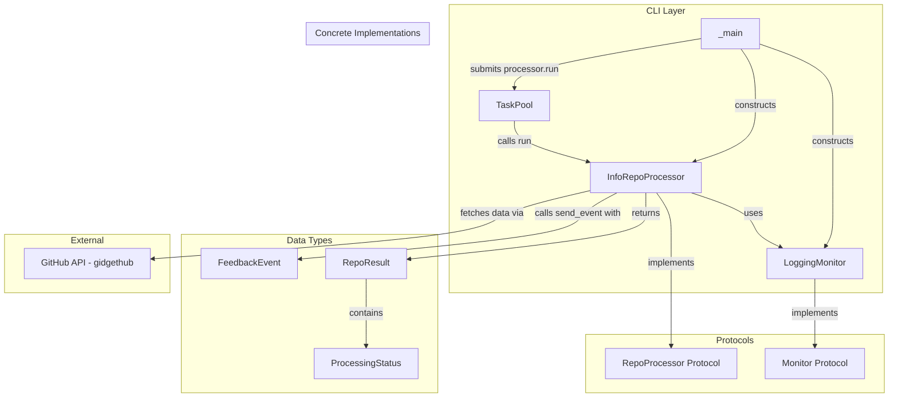
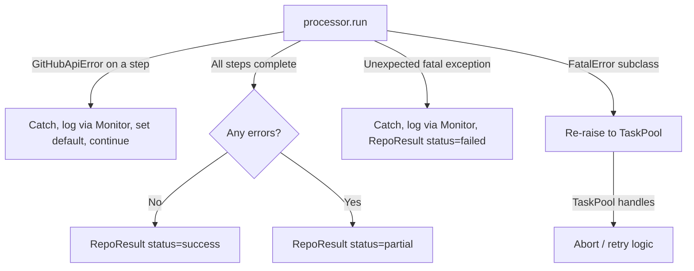
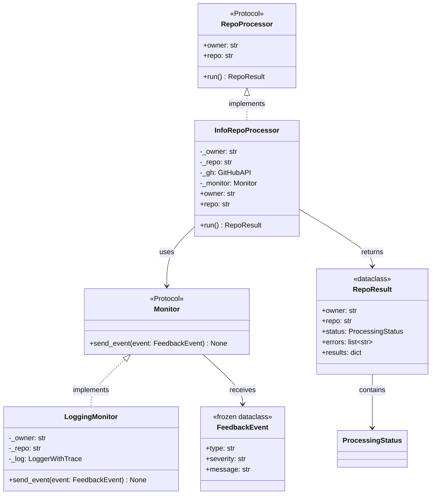

# Design Document: repo-processor

## Overview

This design introduces a protocol-based repository-processing architecture to replace the current `process_repo` stub in `src/ghbot/github/repos.py`. The architecture defines:

- **`RepoProcessor`** — a runtime-checkable `Protocol` that all repository processors implement. It declares read-only `owner` and `repo` attributes and an async `run() -> RepoResult` method.
- **`Monitor`** — a `Protocol` with a single async `send_event(event: FeedbackEvent)` method for reporting typed, severity-tagged events during processing.
- **`FeedbackEvent`** and **`RepoResult`** — dataclasses for structured event reporting and result collection.
- **`LoggingMonitor`** — a concrete `Monitor` backed by the project's existing `get_logger` infrastructure.
- **`InfoRepoProcessor`** — the first concrete `RepoProcessor` that gathers repository summary statistics via the GitHub API.

The caller in `_main` constructs processor instances and submits `processor.run` to the existing `TaskPool`. The `TaskPool` remains unchanged — it calls `run()` on whatever async callable is submitted, decoupled from concrete processor types.

### Design Rationale

**Protocols over ABCs**: Python `Protocol` with `@runtime_checkable` gives structural subtyping — classes satisfy the contract without inheriting from a base. This keeps concrete processors decoupled and simplifies testing (any object with the right shape works). `isinstance` checks still work for runtime validation.

**Monitor as a separate protocol**: Decoupling event reporting from processing logic means processors can be tested with a simple stub monitor, and production code can swap in logging, metrics, or webhook-based monitors without touching processor code.

**Dataclasses for FeedbackEvent and RepoResult**: Immutable, typed, and introspectable. `FeedbackEvent` is frozen (events are fire-and-forget). `RepoResult` is mutable during construction (errors accumulate) but returned as a complete snapshot.

## Architecture



### Control Flow

1. `_main` iterates over `(owner, repo)` tuples from `scan_repositories`.
2. For each tuple, `_main` creates a `LoggingMonitor` and an `InfoRepoProcessor` (passing `owner`, `repo["name"]`, the `GitHubAPI` client, and the monitor).
3. `_main` submits `processor.run` to the `TaskPool`.
4. `TaskPool` acquires a semaphore slot, calls `await processor.run()`, and collects the `RepoResult`.
5. Inside `run()`, the processor sends progress events via the monitor, fetches data points from the GitHub API, handles errors per-step, and returns a `RepoResult`.

### Error Flow



## Components and Interfaces

### New Module: `src/ghbot/processor.py`

All new types live in a single new module. This keeps the processor abstraction self-contained and avoids polluting the existing `github/` package (which is for GitHub API plumbing, not application logic).

#### ProcessingStatus (type alias)

```python
from typing import Literal

ProcessingStatus = Literal["success", "partial", "failed"]
```

A constrained string type. Using `Literal` gives type-checker enforcement without the overhead of an enum.

#### FeedbackEvent (dataclass)

```python
from dataclasses import dataclass

@dataclass(frozen=True, slots=True)
class FeedbackEvent:
    type: str       # e.g. "progress", "fetch", "validation"
    severity: str   # "info", "warning", "error"
    message: str    # human-readable description
```

Frozen and slotted for immutability and memory efficiency. No validation on `severity` at construction — the `LoggingMonitor` maps unknown severities to WARNING as a safe default.

#### RepoResult (dataclass)

```python
from dataclasses import dataclass, field

@dataclass(slots=True)
class RepoResult:
    owner: str
    repo: str
    status: ProcessingStatus = "success"
    errors: list[str] = field(default_factory=list)
    results: dict = field(default_factory=dict)
```

Mutable during processing (errors accumulate, status may change). The `results` dict holds processor-specific data — `InfoRepoProcessor` populates it with statistics keys.

#### Monitor (Protocol)

```python
from typing import Protocol, runtime_checkable

@runtime_checkable
class Monitor(Protocol):
    async def send_event(self, event: FeedbackEvent) -> None: ...
```

Single-method protocol. Any object with an async `send_event` method satisfies it.

#### RepoProcessor (Protocol)

```python
@runtime_checkable
class RepoProcessor(Protocol):
    @property
    def owner(self) -> str: ...

    @property
    def repo(self) -> str: ...

    async def run(self) -> RepoResult: ...
```

Read-only properties for `owner` and `repo`. The `run` method is the sole entry point for processing. Constructor signature is not part of the protocol — concrete implementations define their own `__init__`.

#### LoggingMonitor (class)

```python
class LoggingMonitor:
    def __init__(self, owner: str, repo: str) -> None:
        self._owner = owner
        self._repo = repo
        self._log = get_logger(f"{__name__}.{owner}/{repo}")

    async def send_event(self, event: FeedbackEvent) -> None:
        msg = f"[{event.type}] {self._owner}/{self._repo}: {event.message}"
        level_map = {"info": self._log.info, "warning": self._log.warning, "error": self._log.error}
        log_fn = level_map.get(event.severity, self._log.warning)
        log_fn(msg)
```

Uses `get_logger` from `src/ghbot/log.py` with a namespaced logger name that includes `owner/repo` for filtering. The severity-to-level mapping falls back to WARNING for unrecognised severities.

#### InfoRepoProcessor (class)

```python
class InfoRepoProcessor:
    def __init__(self, owner: str, repo: str, gh: gh_httpx.GitHubAPI, monitor: Monitor) -> None:
        if not owner:
            raise ValueError("owner must be a non-empty string")
        if not repo:
            raise ValueError("repo must be a non-empty string")
        self._owner = owner
        self._repo = repo
        self._gh = gh
        self._monitor = monitor

    @property
    def owner(self) -> str:
        return self._owner

    @property
    def repo(self) -> str:
        return self._repo

    async def run(self) -> RepoResult: ...
```

The `run` method orchestrates data collection across multiple GitHub API endpoints. Each data point is fetched in a separate `async` helper method, wrapped in error handling that catches `GitHubApiError`, logs via the monitor, and falls back to a sensible default.

### Data Points Collected by InfoRepoProcessor

| Data Point | GitHub API Endpoint | Default on Error |
|---|---|---|
| `description` | `GET /repos/{owner}/{repo}` (from repo metadata) | `None` |
| `updated_at` | `GET /repos/{owner}/{repo}` (from repo metadata) | `None` |
| `file_count` | `GET /repos/{owner}/{repo}/git/trees/{default_branch}?recursive=1` | `0` |
| `languages` | `GET /repos/{owner}/{repo}/languages` | `{}` |
| `contributors` | `GET /repos/{owner}/{repo}/contributors` | `[]` |
| `latest_release` | `GET /repos/{owner}/{repo}/releases/latest` | `None` |
| `open_pull_requests` | `GET /repos/{owner}/{repo}/pulls?state=open` (count) | `0` |
| `open_issues` | `GET /repos/{owner}/{repo}/issues?state=open` (count, minus PRs) | `0` |
| `security_alerts` | `GET /repos/{owner}/{repo}/vulnerability-alerts` | `[]` |

The repo metadata endpoint (`GET /repos/{owner}/{repo}`) is called once and reused for `description`, `updated_at`, and the default branch (needed for `file_count`).

### Integration with `_main`

The current `_main` loop:

```python
async for owner, repo in scan_repositories(cfg["owners"], gh):
    await pool.submit(process_repo, owner, repo, gh)
```

Becomes:

```python
async for owner, repo in scan_repositories(cfg["owners"], gh):
    monitor = LoggingMonitor(owner, repo["name"])
    processor = InfoRepoProcessor(owner, repo["name"], gh, monitor)
    await pool.submit(processor.run)
```

The old `process_repo` function in `repos.py` is removed. The import in `__main__.py` changes from `process_repo` to `InfoRepoProcessor` and `LoggingMonitor` from `ghbot.processor`.

`TaskPool` requires no changes — it already accepts any async callable via `submit(fn, *args, **kwargs)`. Since `processor.run` is a bound method with no extra arguments, it's submitted as `pool.submit(processor.run)`.

`TaskPool.results` continues to collect the return values. Previously these were plain dicts; now they are `RepoResult` instances. The `__aexit__` summary log and `stats` dict work unchanged since they only count completions/errors, not inspect result types.

## Data Models

### FeedbackEvent

```python
@dataclass(frozen=True, slots=True)
class FeedbackEvent:
    type: str
    severity: str  # "info" | "warning" | "error"
    message: str
```

- **Frozen**: Events are immutable once created — no mutation after `send_event`.
- **Slots**: Memory-efficient for high-volume event streams.
- **No validation**: Severity is a plain string. The monitor maps it; invalid values get a safe default.

### RepoResult

```python
@dataclass(slots=True)
class RepoResult:
    owner: str
    repo: str
    status: ProcessingStatus = "success"
    errors: list[str] = field(default_factory=list)
    results: dict = field(default_factory=dict)
```

- **Mutable**: Status and errors are updated during `run()` as steps complete or fail.
- **`results` dict**: Keyed by data point name (e.g. `"description"`, `"languages"`). Values are whatever the GitHub API returns (strings, dicts, lists, ints, or `None`).
- **`errors` list**: Collects human-readable error messages. Empty list means no errors.
- **`status` field**: Starts as `"success"`, downgraded to `"partial"` on non-fatal errors, or `"failed"` on fatal/unexpected errors.

### ProcessingStatus

```python
ProcessingStatus = Literal["success", "partial", "failed"]
```

A type alias, not an enum. Keeps serialisation trivial (it's already a string) and avoids import ceremony for a three-value domain.

### Relationships




## Correctness Properties

*A property is a characteristic or behavior that should hold true across all valid executions of a system — essentially, a formal statement about what the system should do. Properties serve as the bridge between human-readable specifications and machine-verifiable correctness guarantees.*

### Property 1: Owner/repo construction round-trip

*For any* non-empty owner string and non-empty repo string, constructing an `InfoRepoProcessor` and reading back the `owner` and `repo` attributes SHALL return the exact same strings that were passed to the constructor.

**Validates: Requirements 1.6**

### Property 2: Severity-to-log-level mapping

*For any* `FeedbackEvent` with a severity in `{"info", "warning", "error"}` and any arbitrary type and message strings, calling `LoggingMonitor.send_event` SHALL produce a log record at the corresponding Python logging level (INFO, WARNING, ERROR respectively).

**Validates: Requirements 3.2, 3.3, 3.4**

### Property 3: Log message contains owner and repo context

*For any* owner string, repo string, and `FeedbackEvent` (with arbitrary type, severity, and message), calling `LoggingMonitor.send_event` SHALL produce a log message that contains both the owner string and the repo string.

**Validates: Requirements 3.5**

### Property 4: Successful run produces correct RepoResult fields

*For any* non-empty owner and repo strings, when all GitHub API calls succeed (mocked), `InfoRepoProcessor.run()` SHALL return a `RepoResult` whose `owner` matches the input owner, whose `repo` matches the input repo, and whose `status` is `"success"`.

**Validates: Requirements 4.2**

### Property 5: Per-step error resilience

*For any* single data-gathering step that raises a `GitHubApiError` (with all other steps succeeding), `InfoRepoProcessor.run()` SHALL return a `RepoResult` with `status` `"partial"`, the error message recorded in the `errors` list, a sensible default value for the failed step, and valid data for all other steps.

**Validates: Requirements 4.5, 6.1, 7.7, 7.9**

### Property 6: Unexpected exception containment

*For any* unexpected exception (not `GitHubApiError`, not `FatalError`) raised during a processing step, `InfoRepoProcessor.run()` SHALL catch the exception, set `status` to `"failed"`, record the error in the `errors` list, and return the `RepoResult` without propagating the exception.

**Validates: Requirements 4.6, 6.2**

### Property 7: FatalError propagation

*For any* `FatalError` subclass (e.g. `GitHubPrimaryRateLimitError`, `GitHubSecondaryRateLimitError`) raised during a processing step, `InfoRepoProcessor.run()` SHALL re-raise the exception so that the `TaskPool` can handle it with its abort/retry logic.

**Validates: Requirements 6.3**

### Property 8: Results dict completeness

*For any* non-empty owner and repo strings, when all GitHub API calls succeed (mocked), `InfoRepoProcessor.run()` SHALL return a `RepoResult` whose `results` dict contains all expected keys: `description`, `updated_at`, `file_count`, `languages`, `contributors`, `latest_release`, `open_pull_requests`, `open_issues`, and `security_alerts`.

**Validates: Requirements 7.2**

## Error Handling

### Error Classification

Errors during processing fall into three categories, each with distinct handling:

| Category | Example | Handling | Status |
|---|---|---|---|
| **Non-fatal API error** | `GitHubApiError` on a single data point | Catch, log via Monitor (severity "error"), set default, continue | `"partial"` |
| **Permission/availability** | 404 on releases, 403 on security alerts | Catch, log via Monitor (severity "warning"), set default, continue | `"partial"` |
| **Unexpected exception** | `RuntimeError`, `ValueError`, etc. | Catch, log via Monitor (severity "error"), stop processing | `"failed"` |
| **Abort-level fatal** | `GitHubPrimaryRateLimitError`, `GitHubSecondaryRateLimitError` | Re-raise to TaskPool | N/A (TaskPool handles) |

### Error Handling in InfoRepoProcessor.run()

```python
async def run(self) -> RepoResult:
    result = RepoResult(owner=self._owner, repo=self._repo)
    await self._monitor.send_event(FeedbackEvent("progress", "info", "processing started"))

    try:
        # Each _fetch_* method catches GitHubApiError internally
        # and returns a default on failure, updating result.errors
        await self._fetch_repo_metadata(result)
        await self._fetch_file_count(result)
        await self._fetch_languages(result)
        await self._fetch_contributors(result)
        await self._fetch_latest_release(result)
        await self._fetch_open_pull_requests(result)
        await self._fetch_open_issues(result)
        await self._fetch_security_alerts(result)
    except (GitHubPrimaryRateLimitError, GitHubSecondaryRateLimitError):
        raise  # Let TaskPool handle abort-level errors
    except FatalError:
        raise  # Other fatal errors also propagate
    except Exception as e:
        await self._monitor.send_event(
            FeedbackEvent("error", "error", f"unexpected error: {e}")
        )
        result.status = "failed"
        result.errors.append(str(e))
    else:
        if result.errors:
            result.status = "partial"
        # else status remains "success"

    await self._monitor.send_event(FeedbackEvent("progress", "info", "processing finished"))
    return result
```

### Per-Step Error Handling Pattern

Each `_fetch_*` method follows the same pattern:

```python
async def _fetch_languages(self, result: RepoResult) -> None:
    await self._monitor.send_event(
        FeedbackEvent("progress", "info", "fetching languages")
    )
    try:
        async with github_api_call(self._gh):
            data = await self._gh.getitem(
                "/repos/{owner}/{repo}/languages",
                url_vars={"owner": self._owner, "repo": self._repo},
            )
        if not data:
            await self._monitor.send_event(
                FeedbackEvent("fetch", "warning", "no language data available")
            )
        result.results["languages"] = data or {}
    except GitHubNotFoundError:
        await self._monitor.send_event(
            FeedbackEvent("fetch", "warning", "languages endpoint not accessible")
        )
        result.results["languages"] = {}
    except GitHubApiError as e:
        await self._monitor.send_event(
            FeedbackEvent("fetch", "error", f"failed to fetch languages: {e}")
        )
        result.results["languages"] = {}
        result.errors.append(f"languages: {e}")
```

The `github_api_call` context manager (from `src/ghbot/github/client.py`) translates raw `gidgethub`/`httpx` exceptions into the project's error hierarchy. The `_fetch_*` methods then handle `GitHubNotFoundError` (permission/availability) separately from general `GitHubApiError` (transient failures).

## Testing Strategy

### Testing Approach

The testing strategy follows the project's TDD approach (Red → Green → Refactor) with a dual testing model:

- **Property-based tests** verify universal correctness properties across generated inputs using `hypothesis`.
- **Unit tests** verify specific examples, edge cases, integration points, and structural conformance.

Both are complementary: property tests catch general correctness issues across the input space, while unit tests pin down specific behaviors and edge cases.

### Property-Based Testing Configuration

- **Library**: `hypothesis` (the standard PBT library for Python)
- **Minimum iterations**: 100 per property (via `@settings(max_examples=100)`)
- **Tag format**: Comment above each test: `# Feature: repo-processor, Property N: <title>`
- **Each correctness property maps to exactly one property-based test**

### Test File Structure

```
tests/unit/
├── test_processor.py          # Unit tests for FeedbackEvent, RepoResult, protocols, LoggingMonitor
├── test_info_processor.py     # Unit tests for InfoRepoProcessor (edge cases, specific scenarios)
├── test_processor_props.py    # Property-based tests for all 8 correctness properties
└── test_main.py               # Updated: tests for _main integration with InfoRepoProcessor
```

### Property Tests (test_processor_props.py)

Each of the 8 correctness properties becomes a single `@given`-decorated test:

| Property | Test | Generators |
|---|---|---|
| 1: Owner/repo round-trip | `test_owner_repo_roundtrip` | `st.text(min_size=1)` for owner and repo |
| 2: Severity-to-level mapping | `test_severity_to_log_level` | `st.sampled_from(["info", "warning", "error"])`, `st.text()` for type/message |
| 3: Log message context | `test_log_message_contains_context` | `st.text(min_size=1)` for owner/repo, `st.builds(FeedbackEvent)` |
| 4: Successful run fields | `test_successful_run_fields` | `st.text(min_size=1)` for owner/repo, mocked gh |
| 5: Per-step error resilience | `test_per_step_error_resilience` | `st.sampled_from(DATA_POINT_STEPS)` to pick which step fails |
| 6: Unexpected exception containment | `test_unexpected_exception_containment` | `st.sampled_from([RuntimeError, ValueError, TypeError, KeyError])` |
| 7: FatalError propagation | `test_fatal_error_propagation` | `st.sampled_from([GitHubPrimaryRateLimitError, GitHubSecondaryRateLimitError])` |
| 8: Results completeness | `test_results_completeness` | `st.text(min_size=1)` for owner/repo, mocked gh |

### Unit Tests (test_processor.py)

- **FeedbackEvent**: construction, immutability (frozen), field access
- **RepoResult**: construction with defaults, field mutation during processing, errors list accumulation
- **RepoProcessor protocol**: isinstance check on conforming class, isinstance fails on non-conforming class
- **Monitor protocol**: isinstance check on LoggingMonitor
- **LoggingMonitor**: severity mapping for each level, unknown severity falls back to WARNING, logger name includes owner/repo

### Unit Tests (test_info_processor.py)

- **Constructor validation**: empty owner raises ValueError, empty repo raises ValueError
- **Happy path**: all API calls succeed → status "success", all keys present
- **Edge cases**: no releases → latest_release is None + warning event, empty languages → {} + warning, security alerts 403 → [] + warning
- **Error scenarios**: single step GitHubApiError → partial, multiple step failures → partial with multiple errors, unexpected exception → failed
- **FatalError propagation**: rate limit errors escape run()
- **Progress events**: start and finish events sent, per-step progress events sent
- **Monitor interaction**: verify send_event called with correct FeedbackEvent instances

### Updated Tests (test_main.py)

- **Integration**: `_main` creates `LoggingMonitor` and `InfoRepoProcessor`, submits `processor.run` to pool
- **Backward compatibility**: verify old `process_repo` import is removed, new imports work

### Mocking Strategy

- **GitHub API**: Mock `gidgethub.httpx.GitHubAPI` methods (`getitem`, `getiter`) to return canned responses
- **Monitor**: Use a simple `RecordingMonitor` (list-collecting stub) for unit tests; real `LoggingMonitor` with `caplog` for logging tests
- **github_api_call**: Patch the context manager when testing error paths to raise specific exceptions
- **AsyncMock**: All async mocks use `unittest.mock.AsyncMock` per project conventions

### Dependency Addition

```bash
uv add --group dev hypothesis
```

`hypothesis` is added to the `dev` dependency group only — it's a test-time dependency.
